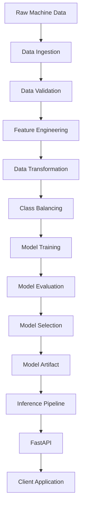

# ⚙️ Predictive Maintenance ML Project


A production-focused machine learning system for **predictive maintenance and machine failure prediction**.

The project processes machine operating data, performs data validation and feature engineering, handles class imbalance, trains and evaluates multiple classification models, tracks experiments with MLflow, and exposes the trained model through a FastAPI inference service.

---

## 📋 Table of Contents

* [Overview](#-overview)
* [Problem Statement](#-problem-statement)
* [ML Problem](#-ml-problem)
* [Dataset](#-dataset)
* [Features](#-features)
* [Feature Engineering](#-feature-engineering)
* [System Architecture](#-system-architecture)
* [ML Pipeline](#-ml-pipeline)

  * [Data Ingestion](#1-data-ingestion)
  * [Data Validation](#2-data-validation)
  * [Data Transformation](#3-data-transformation)
  * [Model Training](#4-model-training)
  * [Model Evaluation](#5-model-evaluation)
  * [Inference Pipeline](#6-inference-pipeline)
  * [API Service](#7-api-service)
* [Models](#-models)
* [Handling Class Imbalance](#-handling-class-imbalance)
* [MLflow](#-mlflow)
* [Project Structure](#-project-structure)
* [Installation](#-installation)
* [Running the Training Pipeline](#-running-the-training-pipeline)
* [Running the API](#-running-the-api)
* [API Usage](#-api-usage)
* [Artifacts](#-artifacts)
* [Logging and Exception Handling](#-logging-and-exception-handling)
* [Technology Stack](#-technology-stack)
* [Future Improvements](#-future-improvements)
* [License](#-license)
* [Developer](#-developer)

---

## 🚀 Overview

Machine failures can result in production downtime, maintenance costs, and equipment damage.

This project aims to predict whether a machine is likely to experience a failure based on its operating conditions.

The system follows a modular ML architecture:

```text
Raw Machine Data
       ↓
Data Ingestion
       ↓
Data Validation
       ↓
Feature Engineering
       ↓
Data Transformation
       ↓
Class Imbalance Handling
       ↓
Model Training
       ↓
Model Evaluation
       ↓
Model Selection
       ↓
Model Serialization
       ↓
Inference Pipeline
       ↓
FastAPI
       ↓
Prediction
```

The project focuses on building a reproducible ML workflow rather than simply training a model inside a notebook.

---

## 🎯 Problem Statement

The objective is to predict whether a machine will experience a failure based on its operating parameters.

The target variable is:

```text
Machine failure

0 → No Machine Failure
1 → Machine Failure
```

This allows the system to identify machines that may require inspection or preventive maintenance.

---

## 🧠 ML Problem

**Problem Type:** Binary Classification

**Target Variable:**

```text
Machine failure
```

**Classes:**

```text
0 → No Failure
1 → Failure
```

The project does not rely only on accuracy because machine-failure datasets can contain class imbalance.

The primary evaluation focus is therefore placed on metrics such as:

* F1 Score
* Precision
* Recall
* ROC-AUC

---

## 📊 Dataset

The dataset contains machine operating conditions and failure-related information.

Important input variables include:

| Feature                   | Description                     |
| ------------------------- | ------------------------------- |
| `Type`                    | Machine/product type            |
| `Air temperature [K]`     | Air temperature in Kelvin       |
| `Process temperature [K]` | Process temperature in Kelvin   |
| `Rotational speed [rpm]`  | Rotational speed                |
| `Torque [Nm]`             | Torque generated by the machine |
| `Tool wear [min]`         | Tool wear time                  |

The target variable is:

```text
Machine failure
```

Additional failure indicators present in the source dataset can include:

```text
TWF
HDF
PWF
OSF
RNF
```

These are treated according to the feature-selection strategy used during the training pipeline.

---

## 🔧 Features

The core machine features used by the inference pipeline are:

```text
Type
Air temperature [K]
Process temperature [K]
Rotational speed [rpm]
Torque [Nm]
Tool wear [min]
```

The system additionally generates derived features.

---

## 🧮 Feature Engineering

Four domain-inspired features are generated during the feature engineering stage.

### Temperature Difference

Measures the difference between process temperature and air temperature.

```python
Temperature Difference = Process temperature [K] - Air temperature [K]
```

### Power Proxy

Provides a proxy for machine power based on rotational speed and torque.

```python
Power Proxy = Rotational speed [rpm] × Torque [Nm]
```

### Torque Tool Wear

Captures the interaction between torque and accumulated tool wear.

```python
Torque Tool Wear = Torque [Nm] × Tool wear [min]
```

### Speed Torque Ratio

Captures the relationship between rotational speed and torque.

```python
Speed Torque Ratio = Rotational speed [rpm] / (Torque [Nm] + 1e-6)
```

These transformations are applied consistently to both training and inference data to maintain **train-serving parity**.

---

## 🏗️ System Architecture



---

# 🔄 ML Pipeline

## 1. Data Ingestion

The data ingestion component:

* Loads the raw machine dataset.
* Performs train-test splitting.
* Stores processed train and test datasets.
* Creates required artifact directories.
* Provides the datasets to downstream pipeline components.

Typical flow:

```text
Raw Dataset
    ↓
Data Ingestion
    ↓
Train Dataset
    +
Test Dataset
```

---

## 2. Data Validation

The validation stage ensures that incoming datasets satisfy the expected schema and data-quality requirements.

Typical checks include:

* Expected columns
* Unexpected columns
* Missing values
* Data types
* Duplicate records
* Numeric ranges
* Categorical values
* Target-column validation

Validation results are stored as a report so that data-quality issues can be inspected after pipeline execution.

---

## 3. Data Transformation

The transformation stage prepares the validated dataset for machine learning.

Depending on the configured preprocessing pipeline, this stage handles:

* Missing-value treatment
* Numerical transformations
* Categorical encoding
* Feature scaling
* Feature selection
* Fitted preprocessing artifact persistence

The fitted preprocessor is saved and reused during inference.

```text
Training Data
     ↓
Preprocessing
     ↓
Fitted Preprocessor
     ↓
preprocessor.pkl
```

During inference, the saved preprocessor is loaded and only `.transform()` is applied.

---

## 4. Model Training

The model-training stage evaluates multiple machine learning algorithms.

Models used in the project include:

* K-Nearest Neighbors
* Decision Tree
* Random Forest
* AdaBoost

Each model is trained and evaluated using the transformed training data.

The models are compared using classification metrics, with particular attention to F1-score due to the machine-failure class imbalance.

---

## 5. Model Evaluation

The model evaluation stage calculates metrics including:

```text
Accuracy
Precision
Recall
F1 Score
ROC-AUC
```

The project emphasizes:

```text
F1 Score
```

because both false positives and false negatives are relevant when predicting machine failures.

Recall is also important because failing to identify an actual machine failure can result in unexpected downtime.

---

## 6. Inference Pipeline

The inference pipeline provides a reusable prediction interface.

The pipeline:

1. Loads the trained model.
2. Loads the fitted preprocessor.
3. Receives machine operating parameters.
4. Performs feature engineering.
5. Applies the saved preprocessor.
6. Generates the prediction.
7. Returns the binary result.

```text
Input
  ↓
CustomData
  ↓
DataFrame
  ↓
Feature Engineering
  ↓
Saved Preprocessor
  ↓
Trained Model
  ↓
Prediction
```

Example:

```python
from src.components.pipeline.inference_pipeline import (
    InferencePipeline,
    CustomData
)

machine = CustomData(
    Type="M",
    air_temperature=298.1,
    process_temperature=308.6,
    rotational_speed=1551,
    torque=42.8,
    tool_wear=0
)

pipeline = InferencePipeline()

df = machine.get_data_as_dataframe()

prediction = pipeline.prediction(df)

print(
    "Machine Failure Predicted"
    if prediction[0] == 1
    else "No Machine Failure Predicted"
)
```

---

## 7. API Service

The project uses **FastAPI** to expose the trained model through a REST API.

### Health Check

```http
GET /
```

Response:

```json
{
    "message": "Machine Failure Prediction API is running."
}
```

### Prediction Endpoint

```http
POST /predict
```

The API accepts machine operating parameters and returns a machine-failure prediction.

---

# 🤖 Models

The baseline model evaluation includes:

| Model         | Type                      |
| ------------- | ------------------------- |
| KNN           | Distance-based classifier |
| Decision Tree | Tree-based classifier     |
| Random Forest | Ensemble classifier       |
| AdaBoost      | Boosting ensemble         |

The best-performing model can then be selected for deployment.

---

# ⚖️ Handling Class Imbalance

Machine failure datasets generally contain significantly fewer failure observations than non-failure observations.

This creates a class-imbalance problem.

The project can use **SMOTE (Synthetic Minority Oversampling Technique)** on the training data to increase representation of the minority class.

The important principle is:

```text
Train-Test Split
       ↓
Training Data
       ↓
SMOTE
       ↓
Model Training
```

SMOTE should not be applied to the test dataset.

The test set should retain its original distribution so that model performance is evaluated on realistic unseen data.

---

# 📈 MLflow

MLflow is used for experiment tracking and model management.

The training pipeline can track:

* Model name
* Hyperparameters
* Training metrics
* Test metrics
* F1-score
* Precision
* Recall
* ROC-AUC
* Model artifacts

The MLflow workflow is:

```text
Model Training
      ↓
MLflow Experiment
      ↓
Parameters
Metrics
Artifacts
      ↓
Model Comparison
      ↓
Best Model
```

Start the MLflow UI with:

```bash
mlflow ui
```

---

# 📁 Project Structure

```text
Predictive-Maintenance-ML-Project/
│
├── artifacts/
│   ├── data/
│   │   ├── raw_data.csv
│   │   ├── train_data.csv
│   │   └── test_data.csv
│   │
│   ├── models/
│   │   └── best_base_model.pkl
│   │
│   └── preprocessors/
│       └── preprocessor.pkl
│
├── logs/
│   └── <timestamp>.log
│
├── reports/
│   └── validation_report.json
│
├── src/
│   ├── components/
│   │   ├── data_ingestion.py
│   │   ├── data_validation.py
│   │   ├── data_transformation.py
│   │   ├── model_training.py
│   │   │
│   │   └── pipeline/
│   │       ├── training_pipeline.py
│   │       └── inference_pipeline.py
│   │
│   ├── exception_handler.py
│   ├── logger.py
│   └── utils.py
│
├── main.py
├── requirements.txt
├── LICENSE
├── NOTICE
└── README.md
```

---

# 🚀 Installation

## Prerequisites

* Python 3.8+
* pip
* Git
* Virtual environment recommended

Create a virtual environment:

```bash
python -m venv venv
```

Activate it on Windows:

```bash
venv\Scripts\activate
```

Install dependencies:

```bash
pip install -r requirements.txt
```

---

# 🏋️ Running the Training Pipeline

Run the complete training pipeline:

```bash
python src/components/pipeline/training_pipeline.py
```

The pipeline performs:

```text
Data Ingestion
      ↓
Data Validation
      ↓
Feature Engineering
      ↓
Data Transformation
      ↓
SMOTE
      ↓
Model Training
      ↓
Model Evaluation
      ↓
Model Selection
      ↓
Model Serialization
```

After execution, check:

```text
artifacts/
reports/
logs/
```

for generated outputs.

---

# 🌐 Running the API

Start the FastAPI server:

```bash
python -m uvicorn main:app --reload
```

The API will be available at:

```text
http://127.0.0.1:8000
```

Interactive Swagger documentation:

```text
http://127.0.0.1:8000/docs
```

---

# 📡 API Usage

### Request

```http
POST /predict
```

Example JSON:

```json
{
    "Type": "M",
    "air_temperature": 298.1,
    "process_temperature": 308.6,
    "rotational_speed": 1551,
    "torque": 42.8,
    "tool_wear": 0
}
```

### Response

```json
{
    "prediction": 0,
    "result": "No Machine Failure Predicted"
}
```

For a predicted failure:

```json
{
    "prediction": 1,
    "result": "Machine Failure Predicted"
}
```

---

# 📦 Artifacts

The project generates and stores important ML artifacts.

### Data Artifacts

```text
artifacts/data/
├── raw_data.csv
├── train_data.csv
└── test_data.csv
```

### Model Artifacts

```text
artifacts/models/
└── best_base_model.pkl
```

### Preprocessing Artifact

```text
artifacts/preprocessors/
└── preprocessor.pkl
```

### Validation Report

```text
reports/
└── validation_report.json
```

These artifacts allow the inference system to use the same preprocessing and trained model generated during training.

---

# 📝 Logging and Exception Handling

The project uses centralized Python logging.

Logs provide information about:

* Pipeline execution
* Data ingestion
* Validation
* Transformation
* Model training
* Model loading
* Prediction
* Errors

Example log structure:

```text
[Timestamp] LineNumber Module - LEVEL - Message
```

A custom exception class is used to propagate pipeline errors with traceback information.

---

# 🛠️ Technology Stack

| Category            | Technology       | Purpose                          |
| ------------------- | ---------------- | -------------------------------- |
| Programming         | Python           | Application and ML development   |
| Data Processing     | Pandas           | Dataset manipulation             |
| Numerical Computing | NumPy            | Numerical operations             |
| Machine Learning    | Scikit-Learn     | Preprocessing and models         |
| Imbalance Handling  | Imbalanced-Learn | SMOTE                            |
| Experiment Tracking | MLflow           | Experiment and model tracking    |
| API                 | FastAPI          | Model serving                    |
| Server              | Uvicorn          | ASGI server                      |
| Validation          | Pydantic         | API input validation             |
| Serialization       | Dill             | Model/preprocessor serialization |
| Logging             | Python Logging   | Application observability        |

---

# 🔮 Future Improvements

Potential improvements include:

* Docker containerization
* CI/CD with GitHub Actions
* Cloud deployment
* Model monitoring
* Data-drift detection
* Model-drift detection
* Automated model retraining
* MLflow Model Registry integration
* Prometheus/Grafana monitoring
* Authentication for the prediction API
* Frontend dashboard for machine-health monitoring
* Batch prediction support
* Kubernetes deployment

---

# 🏁 Conclusion

This project demonstrates an end-to-end machine learning workflow for predictive maintenance.

Rather than treating machine learning as a single model-training script, the system separates the workflow into modular components for:

* Data ingestion
* Data validation
* Feature engineering
* Data transformation
* Class-imbalance handling
* Model training
* Model evaluation
* Model serialization
* Inference
* API serving
* Logging and monitoring

This architecture makes the project easier to maintain, test, reproduce, and extend toward production deployment.

---

# 👨‍💻 Developer

**Viraj Gavade**

ML Engineer / Computer Science Student

GitHub: [viraj-gavade](https://github.com/viraj-gavade)

---

# 📜 License

This project is licensed under the **MIT License**.

See the [`LICENSE`](LICENSE) file for the complete license terms.

---

Built with ❤️ using Python, Scikit-Learn, MLflow, and FastAPI.
